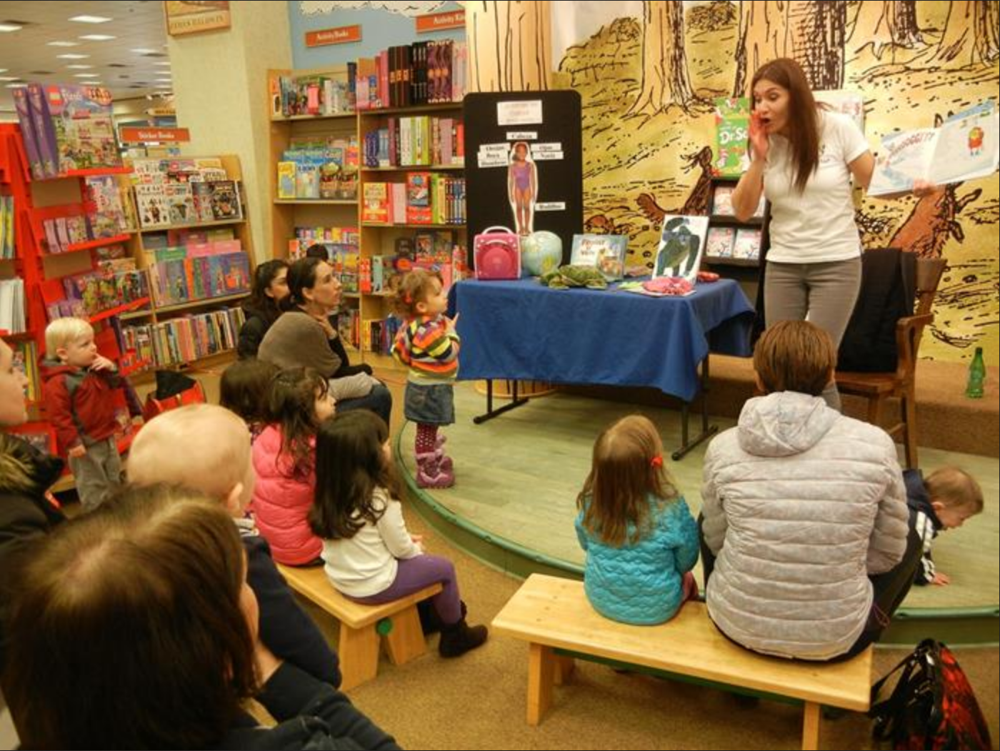
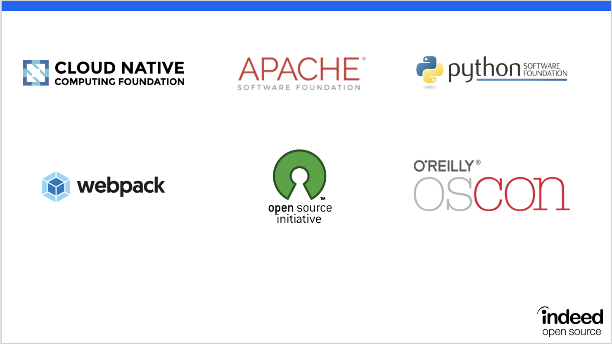
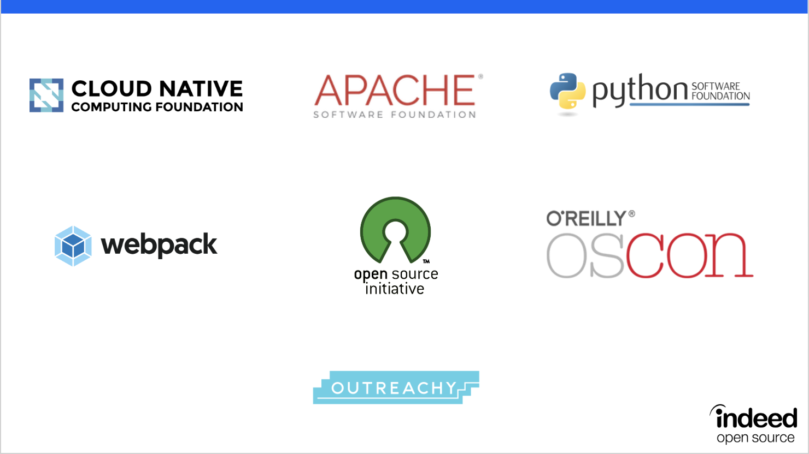
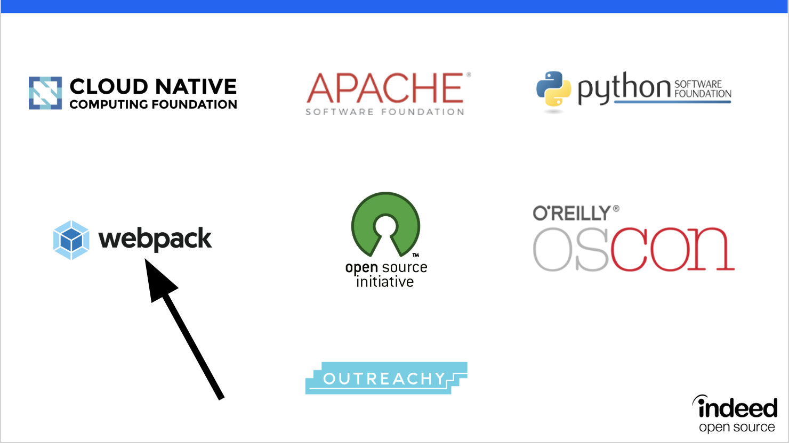

class: center, middle, theBackground

# Sustaining **FOSS** Projects
# By **Democratizing**
# the **Sponsorship** Process
## **Duane O'Brien,** indeed.com
#### He/Him : **@DuaneOBrien** : duaneo@indeed.com
#### **Permissions** Granted : 📸  📹  📰  📬  🐦

---

layout: true
class: theBackground

.footnote-bg[]

.footnote[@DuaneOBrien | duaneo@indeed.com | Made with [Remark](http://remarkjs.com/)]

---

# About Me

* Past Lives :

--

 * 🧙‍♂️ DevsOps-ish **Perl** Guy
--

 * 🧟‍♂️ **Javascript** Ruiner
--

 * 🤹‍♂️ **Agile** Facilitator
--

 * 👨‍🏭 Open Source **Enabler**
--

* Current Life : 👨‍🔧 Head Of Open Source at **Indeed**
--

* Next Life : 👨‍🎤+ 🧛 + 🧙‍♂️ +  🤖 = ?

---

class: center, theEmphatic

# Story Time

???

Indeed was hiring for a long time

When I joined, budget for 2018 had been decided.

---

class: center, theEmphatic

# Story Time

???

"CNCF, Apache, PSF, OSCON, OSI, and Webpack"

---

class: center, theEmphatic

# Story Time

???

"Added Outreachy At My Request"

---

class: center, theEmphatic

# Story Time

???

Webpack had been recommended by someone in another organization

---
# Why Did We **Sponsor** Webpack?

## 👩‍💼 "We should give money to Webpack."

---
# Why Did We **Sponsor** Webpack?

## 👩‍💼 "We should give money to Webpack."

| | | |
|---|---:|---|
| |"I think this is a fantastic idea."| 🧙‍♂️ |

---
# Why Did We **Sponsor** Webpack?

## 👩‍💼 "We should give money to Webpack."

| | | |
|---|---:|---|
| |"I think this is a fantastic idea."| 🧙‍♂️ |

## 👩‍💼 "Awesome."
---
# How It **Supposedly** Works

--

## Program Head Defines A **Budget**
--

## Program Head Selects **Strategic** Sponsorships
--

## Sponsorships Signed **Quarterly**
---

class: center, middle, theEmphatic

# **World Peace**

###### 🌍 + 🕊️

---
# How It **Actually** Works

--

## Program Head **Requests** Budget
--

## Program Head Receives **Adjusted** Budget
--

## Program Head **Earmarks** Sponsorships
---

class: center, middle, theEmphatic

# January **1**

---
# How It **Actually** Works

## Several **New** Opportunities Arise 🤔 💡 💡 💡
--

## **Senior** Folks Make **Recommendations** 🧓 👩‍💼 🧟‍♂️
--

## **High Level** Discussions 👨‍🔧 🧙‍♂️ 🧓 👩‍💼 🧟‍♂️
--

## **Reasonable** Disagreements 😠 👿 😡 🤬 😾

---

class: center, middle, theEmphatic

# **Compromise**

######  😁 😀 😐 😕 😿

---
# This Is **Fine** Except...

--

## High Level Discussions Are **Exclusive**
---

class: center, theEmphatic

# 👨‍🔧 🧙‍♂️ 🧓 👩‍💼 🧟‍♂️
--

## 👩‍💼 👩🏾‍💼 👨‍💼 👩‍💼 👩🏾‍💼 👨‍💼 👨🏿‍💼 👩🏽‍🔬 👩‍🎨 👩🏻‍🎤 👨🏿‍💼
--

___

### 👩🏽‍💻 👩🏻‍🎤 👩🏿‍🎨 👩🏾‍💼 👨‍💼 👩🏻‍🎤 👨🏿‍🎨 👨‍💻 👨‍💼 👩🏾‍💻 👨🏻‍🎤 👨🏿‍💼 👩🏽‍💻 👩🏿‍🎨 👩‍💻 👨‍💼 👨🏿‍💼 👩🏽‍🔬 👨🏿‍🎨 👨🏽‍💻 👩‍💼 👩🏾‍💼 👩🏾‍💻
--

#### 👩🏽‍💻 👨🏽‍💻 👩🏿‍🎨 👩‍💻 👩🏾‍💻 👩🏻‍🎤 👨🏾‍💻 👩🏽‍💻 👩‍💻 👨🏿‍🎨 👨‍💻 👩🏾‍💻 👨🏻‍🎤 👨🏾‍💻 👩🏽‍💻 👩🏿‍🎨 👩‍💻 👩🏾‍💻 👨🏾‍💻 👨‍💻 👩🏽‍💻 👩‍💻 👨🏿‍🎨 👨🏽‍💻 👩🏾‍💻 👨🏻‍🎤 👨🏾‍💻 👩🏽‍💻 👨🏽‍💻 👩🏿‍🎨 👩‍💻 👩🏾‍💻 👩🏻‍🎤 👨🏾‍💻 👨‍💻 👩🏽‍💻 👩‍💻
--

##### 👩🏽‍💻 👨🏽‍💻 👩🏿‍🎨 👩‍💻 👩🏾‍💻 👩🏻‍🎤 👩‍💻 👩🏾‍💻 👨🏾‍💻 👨‍💻 👩🏽‍💻 👩‍💻 👨🏿‍🎨 👨🏽‍💻 👩🏾‍💻 👨🏻‍🎤 👨🏾‍💻 👩🏽‍💻 👨🏽‍💻 👩🏿‍🎨 👩‍💻 👩🏾‍💻 👩🏻‍🎤 👨🏾‍💻 👨‍💻 👩🏽‍💻 👩‍💻 👨🏿‍🎨 👨‍💻 👨🏽‍💻 👨🏻‍🎤 👨🏾‍💻 👩🏽‍💻 👨🏽‍💻 👩🏿‍🎨 👩‍💻 👩🏾‍💻 👩🏻‍🎤 👨🏾‍💻 👩🏽‍💻 👩‍💻
--

##### 👩🏽‍💻 👨🏽‍💻 👩🏽‍💻 👩🏿‍🎨 👩‍💻 👩🏾‍💻 👨🏾‍💻 👨‍💻 👩🏽‍💻 👩‍💻 👨🏿‍🎨 👨🏽‍💻 👩🏾‍💻 👨🏻‍🎤 👨🏾‍💻 👩🏽‍💻 👨🏽‍💻 👩🏿‍🎨 👩‍💻 👩🏾‍💻 👩🏻‍🎤 👨🏾‍💻 👨‍💻 👩🏽‍💻 👩‍💻 👨🏿‍🎨 👨‍💻 👨🏽‍💻 👨🏻‍🎤 👨🏾‍💻 👩🏽‍💻 👨🏽‍💻 👩🏿‍🎨 👩‍💻 👩🏾‍💻 👩🏻‍🎤 👩🏿‍🎨 👩‍💻 👩🏾‍💻 👩🏻‍🎤 👨🏾‍💻
--

##### 👩🏽‍💻 👨🏽‍💻 👩🏿‍🎨 👨🏻‍🎤 👨🏾‍💻 👩🏽‍💻 👨🏽‍💻 👩🏿‍🎨 👩‍💻 👩🏾‍💻 👩🏻‍🎤 👨🏾‍💻 👨‍💻 👩🏽‍💻 👩‍💻 👨🏿‍🎨 👨‍💻 👨🏽‍💻 👨🏻‍🎤 👨🏾‍💻 👩🏽‍💻 👨🏽‍💻 👩🏿‍🎨 👩‍💻 👩🏽‍💻 👩‍💻 👨🏿‍🎨 👨‍💻 👩🏾‍💻 👨🏻‍🎤 👨🏾‍💻 👩🏽‍💻 👩🏿‍🎨 👩‍💻 👩🏾‍💻 👨🏾‍💻 👩🏾‍💻 👩🏻‍🎤 👨🏾‍💻 👩🏽‍💻 👩‍💻
--

##### 👩🏽‍💻 👨🏽‍💻 👩🏿‍🎨 👨🏾‍💻 👩🏽‍💻 👩🏿‍🎨 👩‍💻 👩🏾‍💻 👨🏽‍💻 👩🏿‍🎨 👩‍💻 👩🏾‍💻 👩🏻‍🎤 👨🏾‍💻 👨‍💻 👩🏽‍💻 👩‍💻 👨🏿‍🎨 👨‍💻 👨🏽‍💻 👨🏻‍🎤 👨🏾‍💻 👨‍💻 👩🏽‍💻 👩‍💻 👨🏿‍🎨 👨🏽‍💻 👩🏾‍💻 👨🏻‍🎤 👨🏾‍💻 👩🏽‍💻 👨🏾‍💻 👩🏽‍💻 👨🏽‍💻 👩🏿‍🎨 👩‍💻 👩🏾‍💻 👩🏻‍🎤 👨🏾‍💻 👩🏽‍💻 👩‍💻
---

# This Is **Fine** Except...

## High Level Discussions Are **Exclusive**

## High Level Discussions Are Seldom **Transparent**
--

## Teams And Individuals Must **Escalate** Requests
---

class: center, theEmphatic

# 👨‍🔧 🧙‍♂️ 🧓 👩‍💼 🧟‍♂️

## 👩‍💼 👩🏾‍💼 👨‍💼 👩‍💼 👩🏾‍💼 👨‍💼 👨🏿‍💼 👩🏽‍🔬 👩‍🎨 👩🏻‍🎤 👨🏿‍💼

___

### 👩🏽‍💻 👩🏻‍🎤 👩🏿‍🎨 👩🏾‍💼 👨‍💼 👩🏻‍🎤 👨🏿‍🎨 👨‍💻 👨‍💼 👩🏾‍💻 👨🏻‍🎤 👨🏿‍💼 👩🏽‍💻 👩🏿‍🎨 👩‍💻 👨‍💼 👨🏿‍💼 👩🏽‍🔬 👨🏿‍🎨 👨🏽‍💻 👩‍💼 👩🏾‍💼 👩🏾‍💻

#### 👩🏽‍💻 👨🏽‍💻 👩🏿‍🎨 👩‍💻 👩🏾‍💻 👩🏻‍🎤 👨🏾‍💻 👩🏽‍💻 👩‍💻 👨🏿‍🎨 👨‍💻 👩🏾‍💻 👨🏻‍🎤 👨🏾‍💻 👩🏽‍💻 👩🏿‍🎨 👩‍💻 👩🏾‍💻 👨🏾‍💻 👨‍💻 👩🏽‍💻 👩‍💻 👨🏿‍🎨 👨🏽‍💻 👩🏾‍💻 👨🏻‍🎤 👨🏾‍💻 👩🏽‍💻 👨🏽‍💻 👩🏿‍🎨 👩‍💻 👩🏾‍💻 👩🏻‍🎤 👨🏾‍💻 👨‍💻 👩🏽‍💻 👩‍💻

##### 👩🏽‍💻 👨🏽‍💻 👩🏿‍🎨 👩‍💻 👩🏾‍💻 👩🏻‍🎤 👩‍💻 👩🏾‍💻 👨🏾‍💻 👨‍💻 👩🏽‍💻 👩‍💻 👨🏿‍🎨 👨🏽‍💻 👩🏾‍💻 👨🏻‍🎤 👨🏾‍💻 👩🏽‍💻 👨🏽‍💻 👩🏿‍🎨 👩‍💻 👩🏾‍💻 👩🏻‍🎤 👨🏾‍💻 👨‍💻 👩🏽‍💻 👩‍💻 👨🏿‍🎨 👨‍💻 👨🏽‍💻 👨🏻‍🎤 👨🏾‍💻 👩🏽‍💻 👨🏽‍💻 👩🏿‍🎨 👩‍💻 👩🏾‍💻 👩🏻‍🎤 👨🏾‍💻 👩🏽‍💻 👩‍💻

##### 👩🏽‍💻 👨🏽‍💻 👩🏽‍💻 👩🏿‍🎨 👩‍💻 👩🏾‍💻 👨🏾‍💻 👨‍💻 👩🏽‍💻 👩‍💻 👨🏿‍🎨 👨🏽‍💻 👩🏾‍💻 👨🏻‍🎤 👨🏾‍💻 👩🏽‍💻 👨🏽‍💻 👩🏿‍🎨 👩‍💻 👩🏾‍💻 👩🏻‍🎤 👨🏾‍💻 👨‍💻 👩🏽‍💻 👩‍💻 👨🏿‍🎨 👨‍💻 👨🏽‍💻 👨🏻‍🎤 👨🏾‍💻 👩🏽‍💻 👨🏽‍💻 👩🏿‍🎨 👩‍💻 👩🏾‍💻 👩🏻‍🎤 👩🏿‍🎨 👩‍💻 👩🏾‍💻 👩🏻‍🎤 👨🏾‍💻

##### 👩🏽‍💻 👨🏽‍💻 👩🏿‍🎨 👨🏻‍🎤 👨🏾‍💻 👩🏽‍💻 👨🏽‍💻 👩🏿‍🎨 👩‍💻 👩🏾‍💻 👩🏻‍🎤 👨🏾‍💻 👨‍💻 👩🏽‍💻 👩‍💻 👨🏿‍🎨 👨‍💻 👨🏽‍💻 👨🏻‍🎤 👨🏾‍💻 👩🏽‍💻 👨🏽‍💻 👩🏿‍🎨 👩‍💻 👩🏽‍💻 👩‍💻 👨🏿‍🎨 👨‍💻 👩🏾‍💻 👨🏻‍🎤 👨🏾‍💻 👩🏽‍💻 👩🏿‍🎨 👩‍💻 👩🏾‍💻 👨🏾‍💻 👩🏾‍💻 👩🏻‍🎤 👨🏾‍💻 👩🏽‍💻 👩‍💻

##### 👩🏽‍💻 👨🏽‍💻 👩🏿‍🎨 👨🏾‍💻 👩🏽‍💻 👩🏿‍🎨 👩‍💻 👩🏾‍💻 👨🏽‍💻 👩🏿‍🎨 👩‍💻 👩🏾‍💻 👩🏻‍🎤 👨🏾‍💻 👨‍💻 👩🏽‍💻 👩‍💻 👨🏿‍🎨 👨‍💻 👨🏽‍💻 👨🏻‍🎤 👨🏾‍💻 👨‍💻 👩🏽‍💻 👩‍💻 👨🏿‍🎨 👨🏽‍💻 👩🏾‍💻 👨🏻‍🎤 👨🏾‍💻 👩🏽‍💻 👨🏾‍💻 👩🏽‍💻 👨🏽‍💻 👩🏿‍🎨 👩‍💻 👩🏾‍💻 👩🏻‍🎤 👨🏾‍💻 👩🏽‍💻 👩‍💻
---

class: center, middle, theEmphatic

---
# FOSS **Contributor** Fund

## **Dedicated** Budget Unrelated To Orgs/Confs
--

## Projects Are **Nominated** By Employees
--

## Projects Must Meet **Selection Criteria**
--

## Contributors **Vote** On Allocation
---
# FOSS **Contributor** Fund

## **Dedicated** Budget Unrelated To Orgs/Confs

## Projects Are **Nominated** By Employees

## Projects Must Meet **Selection Criteria**

## Contributors **Vote** On Allocation : $10,000 / 🗓
---
# Project **Selection Criteria**

--

## ✅ Must Use An **OSI-Approved License**
--

## ✅ Must Be **Used** By Indeed
--

## ✅ Must Have A Way To **Receive Funds**
--

## ✅ Must Not Be **Employee Owned**
---
# **Goals** Of The Initiative
--

##  🥅 Drive Open Source **Participation** Within Indeed
--

##  🥅 Highlight Projects **Important** To Everyone  
--

##  🥅 Support And **Sustain** Our Dependencies
--

##  🥅 Try Something **New** In The Sustainability Space

---

class: center, middle, theEmphatic

# What Could **Possibly** Go Wrong?

---
# What Could **Possibly** Go Wrong?

## 🚫 Money Might Be **Wrong** For The Project
--

## 🧟‍♂️ Voting Might Select A **Problematic** Project
--

## 🚨 Our **Process** Might Break Down
--

## 👮‍♀️ We Might Need To **Curate** Nominations
---

class: center, middle, theEmphatic

# How Did We Get **Executive** Buy-In?

---
# How Did We Get **Executive** Buy-In?

## 👨‍🔧 "TL;DR - $120k for a Sustainability Fund?"
???
"I am asking for a budget of $120,000 allocated in 2019 for distribution to open source projects which Indeed consumes. Each month, Indeed would distribute $10,000 to a project voted on by Indeedians who made an open source contribution that month. This would democratize where some of Indeed’s open source dollars go, while giving open source participants motivation to self-identify and engage with the program."

---
# How Did We Get **Executive** Buy-In?

## 👨‍🔧 "TL;DR - $120k for a Sustainability Fund?"

| | | |
|---|---:|---|
| |"I think this is a fantastic idea."| 🧙‍♂️ |

---
# How Did We Get **Executive** Buy-In?

## 👨‍🔧 "TL;DR - $120k for a Sustainability Fund?"

| | | |
|---|---:|---|
| |"I think this is a fantastic idea."| 🧙‍♂️ |

## 👨‍🔧 "... "
---
# Why Did We **Sponsor** Webpack?

## 👩‍💼 "We should give money to Webpack."

| | | |
|---|---:|---|
| |"I think this is a fantastic idea."| 🧙‍♂️ |

## 👩‍💼 "Awesome."
---
class: center, middle, theEmphatic

# **Always** Ask

---

class: center, middle, theEmphatic

# What Have We **Learned** So Far?

---

# What Have We **Learned** So Far?

## January Contributions:

---

# What Have We **Learned** So Far?

## January Contributions: Went **Up!** 📈

---

class: center, middle, theEmphatic

---

# What Have We **Learned** So Far?

## January Contributions: Went **Up!** 📈

## Nominated Projects:

---

# What Have We **Learned** So Far?

## January Contributions: Went **Up!** 📈

## Nominated Projects: **20** Total
---

# What Have We **Learned** So Far?

## January Contributions: Went **Up!** 📈

## Nominated Projects: **20** Total - 5 **Unknown** 🕵️‍♀️
---

# What Have We **Learned** So Far?

## January Contributions: Went **Up!** 📈

## Nominated Projects: **20** Total - 5 **Unknown** 🕵️‍♀️

## Participation:
---

# What Have We **Learned** So Far?

## January Contributions: Went **Up!** 📈

## Nominated Projects: **20** Total - 5 **Unknown** 🕵️‍♀️

## Participation: **TBD** 🤷‍♂️ 🐥

---

class: center, middle, theEmphatic

# What Can **You** Do?

---

# What Can **You** Do?

## Get In Touch : **opensource@indeed.com**
--

## **Advocate** For Projects : 🗣 🗣 🗣 🗣 🗣 🗣 🗣 🗣 🗣 🗣
--

## **Always** Ask : 👨🏿‍🎨 👨🏽‍💻 👨🏻‍🎤 👨🏾‍💻 👨🏽‍💻 👩🏿‍🎨 👩‍💻 👩🏾‍💻 👩🏻‍🎤 👨🏾‍💻 👨‍💻 👩🏽‍💻 👩‍💻 👨🏿‍🎨
--

## Start **Now** : opencollective.com/gift-cards

---
class: center, middle, theEmphatic

# Questions?

---
class: center, middle, theEmphatic

# Thank You
