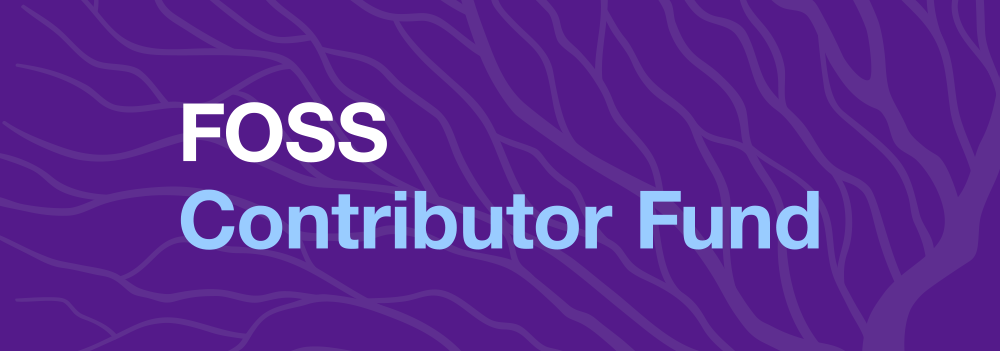

class: center, middle, theBackground

## Your Company Cares About **FOSS Sustainability**
## But Are You **Measuring** Your Contributions?
 
### **Duane O'Brien** - Head of Open Source - indeed.com
### **Dani Gellis** - Software Engineer - indeed.com
 
### **Permissions** Granted : 📸  📹  📰  📬  🐦

---

layout: true
class: theBackground

.footnote-bg[]

.footnote[@DuaneOBrien | @DanisYellis | Made with [Remark](http://remarkjs.com/)]

---

# About Me

* Past Lives :

--

 * 🧙‍♂️ DevsOps-ish **Perl** Guy
--

 * 🧟‍♂️ **Javascript** Ruiner
--

 * 🤹‍♂️ **Agile** Facilitator
--

 * 👨‍🏭 Open Source **Enabler**
--

* Current Life : 👨‍🔧 Head Of Open Source at **Indeed**
--

* Next Life : 👨‍🎤+ 🧛 + 🧙‍♂️ +  🤖 = ?

---

Program Goals And Philosophy Overview (5 min)

---

“You will encourage the behavior you measure”

---
How We Measure Contributions (30 min)Le

---

What’s A Contribution

---

Not Just Code

---

GitHub’s New Cross Indicator

---

“Company Related”

---

Potato Metrics

---

GitHub Is Not Your Resume

---

How we captured/capture non-github requests (and why)

---

What Not To Measure And Why

---

Contributions

---

Lines of Code

---

Default to Open - do we share the raw numbers?

---

Active Recurring Participants

---

class: center, middle, theEmphatic

---
# FOSS **Contributor** Fund

## **Dedicated** Budget Unrelated To Orgs/Confs
--

## Projects Are **Nominated** By Employees
--

## Projects Must Meet **Selection Criteria**
--

## Contributors **Vote** On Allocation
---
# FOSS **Contributor** Fund

## **Dedicated** Budget Unrelated To Orgs/Confs

## Projects Are **Nominated** By Employees

## Projects Must Meet **Selection Criteria**

## Contributors **Vote** On Allocation : $10,000 / 🗓
---

class: center, middle, theEmphatic

# What Have We **Learned** So Far?

---

# What Have We **Learned** So Far?

## January Contributions:

---

# What Have We **Learned** So Far?

## January Contributions: Went **Up!** 📈

---

class: center, middle, theEmphatic

---

# What Have We **Learned** So Far?

## January Contributions: Went **Up!** 📈

## Nominated Projects:

---

# What Have We **Learned** So Far?

## January Contributions: Went **Up!** 📈

## Nominated Projects: **20** Total

---

# What Have We **Learned** So Far?

## January Contributions: Went **Up!** 📈

## Nominated Projects: **20** Total - 5 **Unknown** 🕵️‍♀️

---

# What Have We **Learned** So Far?

## January Contributions: Went **Up!** 📈

## Nominated Projects: **20** Total - 5 **Unknown** 🕵️‍♀️

## Participation:

---

# What Have We **Learned** So Far?

## January Contributions: Went **Up!** 📈

## Nominated Projects: **20** Total - 5 **Unknown** 🕵️‍♀️

## Participation: **TBD** 🤷‍♂️ 🐥

---

What Effect Our Initiatives Have (15)

---

Hacktoberfest

---

The November Lull

---

24 Pull Requests

---

FOSS Contributor Fund

---

First Time Contributors

---

Hackathon

---

Outliers

---

The effect on measuring contributions

---

The effect on measuring contributors

---

The effect over time

---

Conclusion (5 min)

---
class: center, middle, theEmphatic

# Questions?

---
class: center, middle, theEmphatic

# Thank You
