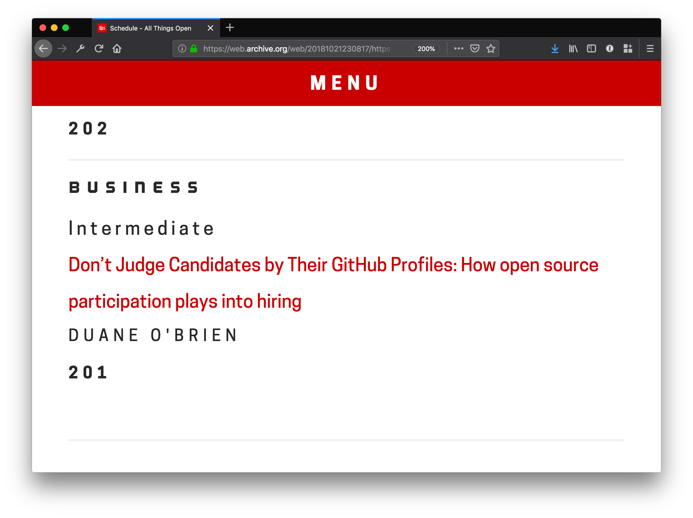
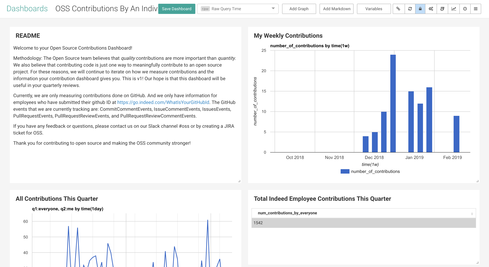
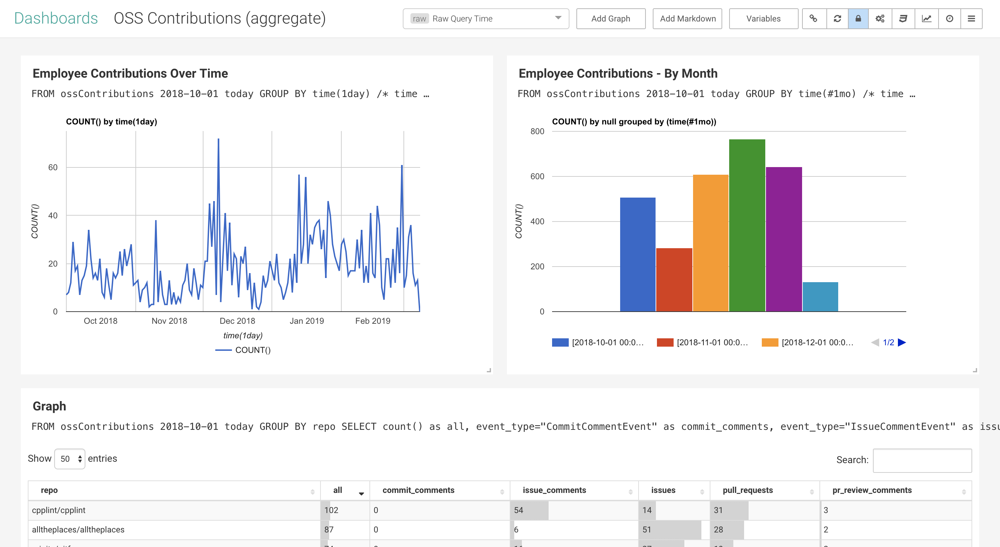
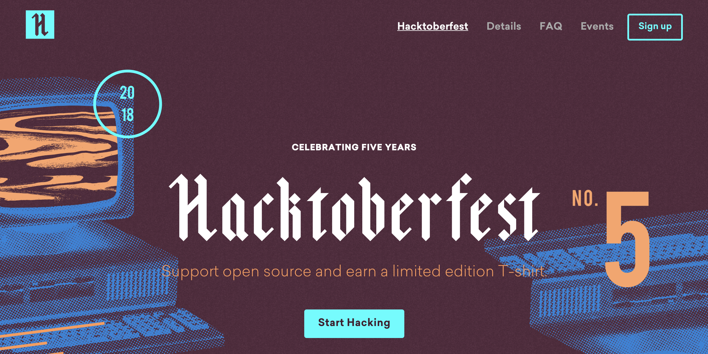
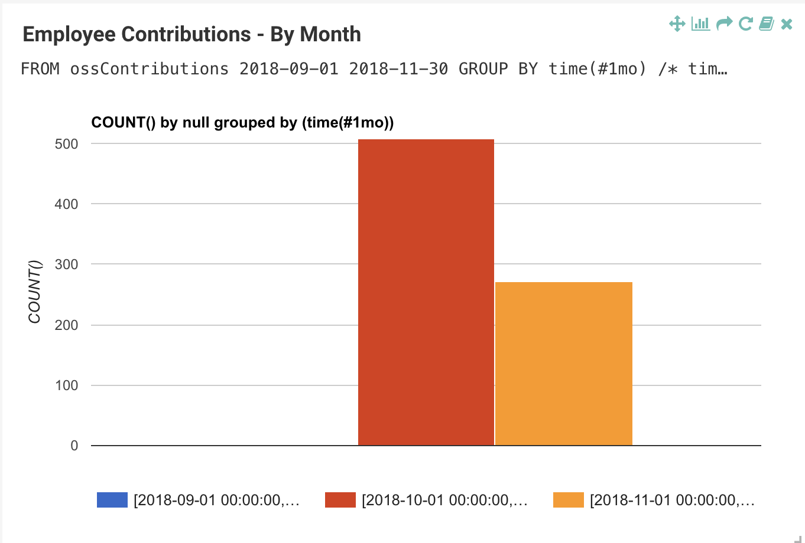
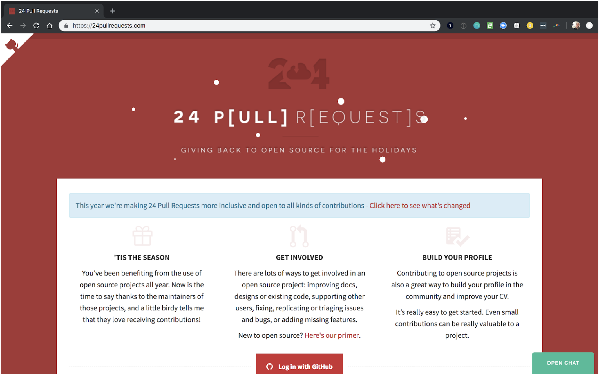
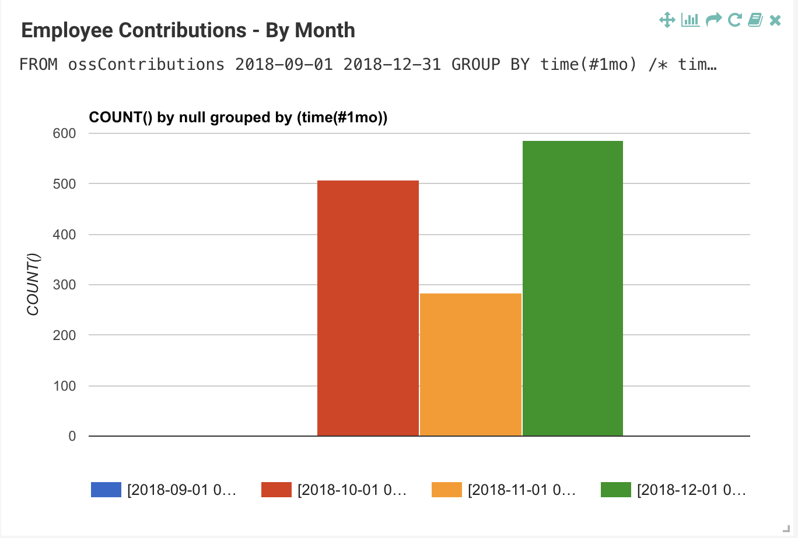
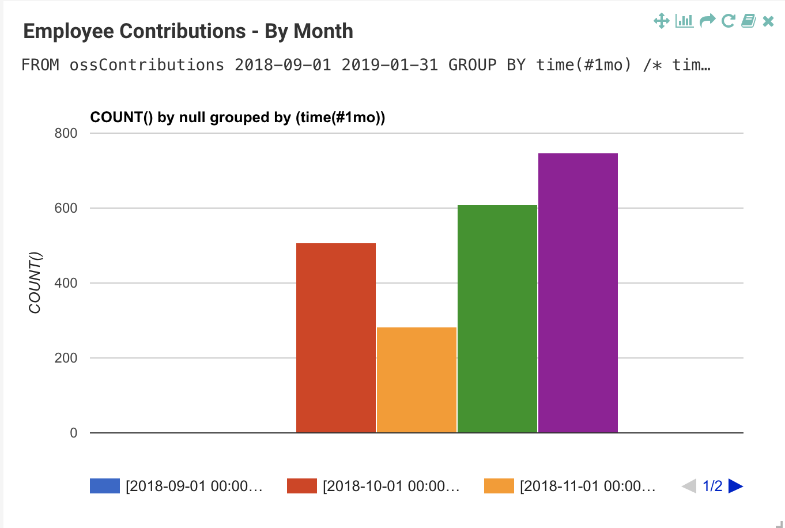
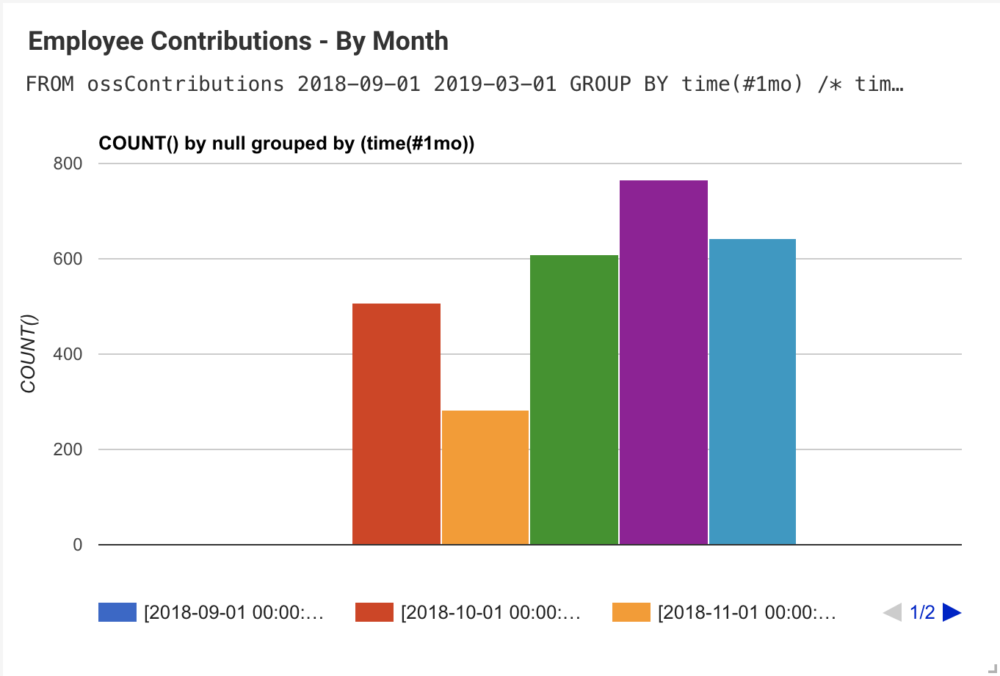
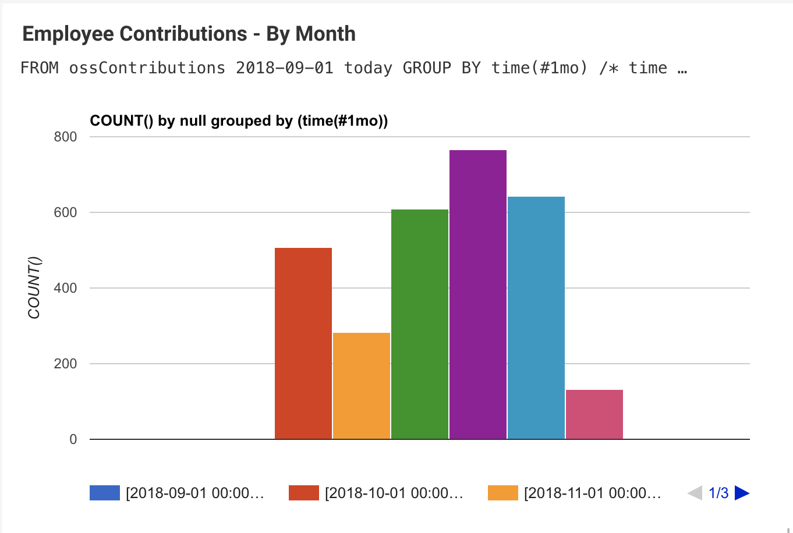

class: center, middle, theBackground

## Your Company Cares About **FOSS Sustainability**
## But Are You **Measuring** Your Contributions?
 
### **Duane O'Brien**
### **Dani Gellis**
### indeed.com
 
### **Permissions** Granted : 📸  📹  📰  📬  🐦

---

layout: true
class: theBackground

.footnote-bg[]

.footnote[@DuaneOBrien | @DanisYellis | Made with [Remark](http://remarkjs.com/)]

---

# About **Duane**

* Past Lives :

--

 * 🧙‍♂️ DevsOps-ish **Perl** Guy
--

 * 🧟‍♂️ **Javascript** Ruiner
--

 * 🤹‍♂️ **Agile** Facilitator
--

 * 👨‍🏭 Open Source **Enabler**
--

* Current Life : 👨‍🔧 Head Of Open Source at **Indeed**
--

* Next Life : 👨‍🎤+ 🧛 + 🧙‍♂️ +  🤖 = ?

---

# About **Dani**

* Past Lives :

--

 * 🧙‍♂️
--

 * 🧟‍♂️
--

 * 🤹‍♂️
--

 * 👨‍🏭
--

* Current Life : 👨‍🔧
--

* Next Life : 👨‍🎤+ 🧛 + 🧙‍♂️ +  🤖 = ?

---
# Overview

--
* ### Program **Overview**

--
* ### What We Decided To Measure And **Why**

--
* ### Tools We Looked At, Implemented, And **Built**

--
* ### What We Learned **So Far**

--
* ### What We'll Measure And Build **Next**

---
# Indeed's **Open Source** Program
--

* ### Open Source Is **More** Than Software

--

* ### We **Meet You** Where You Are

--

* ### Predictable, **Long Term Support** Is The Ideal

---

class: center, middle, theEmphatic

# To build a culture of **active** and **recurring** open source **participation**

---

class: middle, theEmphatic

# If you can't measure it, you can't improve it - **Peter Drucker**

---

class: center, middle, theEmphatic

???

“I often say that when you can measure what you are speaking about, and express it in numbers, you know something about it; but when you cannot measure it, when you cannot express it in numbers, your knowledge is of a meagre and unsatisfactory kind; it may be the beginning of knowledge, but you have scarcely, in your thoughts, advanced to the stage of science, whatever the matter may be.” - Lord Kelvin

---

class: center, middle, theEmphatic

# What Counts As A **Contribution?**

---

# What **Not** To Measure And **Why**

--

## Lines of Code

--

 * ### Encourages Code Quantity With No Eye Toward Quality

--

## Contribution Counts

--

 * ### Competition Discourages New Contributors

--

 * ### Projects Have To Manage Low Quality Contributions

---

# Other **Important** Considerations

--

## Sharing **Raw** Numbers
--

## How To Account For **Personal** Projects

--

## What Does **"Company Related"** Mean?

---

class: center, middle, theEmphatic

# Active **Recurring** Participants

---

# Active **Recurring** Participants

* ## **Active** - triggered an event that we care about

--

* ## **Recurring** - two or more days of activity

--

* ## **Participation** - a broad category of events

---

class: center, middle, theEmphatic

---

class: center, middle, theEmphatic

???

Not all open source activity is on GitHub
I have a whole talk about it.
But it can give us an Accurate read, even if it's not very precise

---

class: center, middle, theEmphatic

???

Not all open source activity is on GitHub
I have a whole talk about it.
But it can give us an Accurate read, even if it's not very precise

---

class: center, middle, theEmphatic

???

Potato Metrics

---

class: center, middle, theEmphatic

???

How we captured/capture non-github requests (and why)

---
class: center, middle, theEmphatic

# The Challenge (and opportunity)
## We’re measuring something different
### Indeed Employee (User) contributions
### vs.
### Indeed's Open Source (Org/Repo) health

####Many open source tools for measuring the latter, but None for the former
???
How can we help the Open Source community vs. how much does the Open Source community care about our project

Everyone else is measuring their projects and contribution activity for them.

We care about Indeedians contributing out. Want to measure contributions

---
class: center, middle, theEmphatic

# Existing Tools

#### None of these tools do what we want- but can they be adapted?

???
Looked at 4 or 5 different tools- Netflix OSS Dashboard, Amazon's OSS Dashboard, Bitergia
Started with github because there are tools for gh and a robust API, and it’s where most, though not all, of the contributing is happening anyway
Bitergia has a solution that looks at more than just github, but, like all the tools-
Org/Project-oriented, not User oriented
			Getting ORG users gives us non-indeed employees
			Getting ORG users misses some indeed employees
			“N users that may not relate to an org”

---
# Microsoft’s Github Crawler
### Gets information about events on GitHub
#### but it is Org/Repo focused
####  Yes, we _CAN_ adapt it
##### Positives and negatives
???
like all the others, org/repo focused
Seemed easiest to get it to do what we wanted. And, in JS, which is what I know and I was the only engineer (growing team)

Negatives:
There’s a lot of code that does a lot of cool things, but we can only use some of them
-Github API allows traversing a user’s events, but does not have webhooks for that. Though they do have webhooks for events related to an org/repo
Positives:
	-Extensibility. Some day we’ll care about our org/repo health too and it will be easy to add
-Adding to an existing, used open source project

---
# The "Interim Dashboard"
## This came first to get us some numbers
### Nothing to look at, but very useful!

???

before figuring out how to get the crawler to work
was VERY useful for counting Hacktoberfest contribs, getting a baseline, etc.
  -if want to do something like FOSS fund, it's all you need - we're still going to use that code for it
basically just poking the github api for user events and filtering them by events we care about
and then just put the output into a google sheet
---
# Events we’re measuring, and why

##Events we are measuring:
* Comments
* Pull Requests
* Issues
* Code Reviews

## Events we’re not:
* Push Events

???
Not just code, also comments and Reviews
Not push events because
  - probably personal projects
  - not good open source hygiene
---
# Dashboard Solutions
## Tried MeasureOSS
### It was also Org/Repo focused
#### and adding user views would have made everything more confusing
???
Once we had the contribs, need to show them somehow
Measure:
An important part of open source work- make sure the upstream wants the change!
They were interested in the concept, but not in changing their project
---
# Dashboard Solutions
## Use Imhotep and IQL (Imhotep Query Language)
* 2 Different Dashboards
  * Individual Contributor Dashboard
  * Aggregate Dashboard

???
decided to use Indeed's OS project
  - allows you to build and query large datasets, and build tools for analysis and dashboards
---
#Contributor Dashboard
### allows each Indeedian to see their own contributions
#### Useful for quarterly reviews!
---
class: center, middle, theEmphatic

???
our contributors are happy to have it for reviews
---
# Aggregate Dashboard
### Used by the Open Source Program Office
#### Allows us to keep track of contribs by all Indeedians and, therefore, how we’re doing
---
class: center, middle, theEmphatic

---
# What’s next
1. Adding other online code repositories (Bitbucket, Apache, etc.) and organization tools (Jira, Slack, etc.)
### Important for 2 reasons:
* Encouraging and tracking non-code contributions
* Tracking all contributions, not just the ones on GitHub
???
so many other things are helpful besides just code- design, project management, legal, etc.
However, we do have a form for people to tell us about their other contribs
---
# What’s next
1. Adding Bitbucket, Apache, Jira, Slack, etc.

--
2. Counting PushEvents to our own (IndeedEng) repos?

--
3. Tracking IndeedEng repo and org health

--
4. More filtering of events (do some repos have more weight?)
 * Projects Indeed uses
 * Stop measuring a user's personal practice projects on GitHub

--
5. A toggle to put in and take out Indeed-owned projects

???
(the metric everyone else is tracking) - we do care if we’re contributing to the OS community that way
- Track inbound requests, for example

---

class: center, middle, theEmphatic

# What Have We Learned **So Far**

---

# Highly Active Users : **Outliers**

--

## How Active? **10x?**
---

# Highly Active Users : **Outliers**

## How Active? ~~10x?~~ **100x!!!**

--
## Competition Discourages **New Contributors**

--
## Don't Build For **Edge Cases**

--

## Should Even Out **Over Time**

---

class: center, middle, theEmphatic

# Measuring The Effect Of **Initiatives**

---
class: center, middle, theEmphatic

---
class: center, middle, theEmphatic

---

class: center, middle, theEmphatic

# The **November** Lull

---
class: center, middle, theEmphatic

---
class: center, middle, theEmphatic

---
class: center, middle, theEmphatic

---
class: center, middle, theEmphatic

---
# FOSS **Contributor** Fund

## **Dedicated** Budget Unrelated To Orgs/Confs
--

## Projects Are **Nominated** By Employees
--

## Projects Must Meet **Selection Criteria**
--

## Contributors **Vote** On Allocation : $10,000 / 🗓
---

# FOSS **Contributor** Fund : **January**

## January Contributions: Went **Up!** 📈

---

class: center, middle, theEmphatic

---

# FOSS **Contributor** Fund : **January**

## January Contributions: Went **Up!** 📈

## Nominated Projects: **20** Total - 5 **Unknown** 🕵️‍♀️

---

# FOSS **Contributor** Fund : **February**

## February Contributions: Went **Down...** 📉

---

class: center, middle, theEmphatic

---

# FOSS **Contributor** Fund : **February**

## February Contributions: Went **Down...** 📉

## Nominated Projects: **5**

???

october - 34
november - 23
december - 27
january - 32
february - 26
march - 17 (but on track with Jan)

---

# FOSS **Contributor** Fund : **March**

## March Contributions: **TBD** 🤷‍♂️

---

class: center, middle, theEmphatic

---

class: center, middle, theEmphatic

# What We **Measure** And **Build** Next

---

# What We **Measure** And **Build** Next

## Are We **Creating** New Contributors?

--
* ### First Time Contributors Events

--
* ### Onboarding Training

--

## Are We **Sustaining** Projects We Use?

--
* ### OSS Compliance + Contribution Measurement = 🎉

---
# Review

--
* ### **Values** First. **Goals** Second. **Tooling** When You **Need** It.

--
* ### Be **Mindful** About What You **Measure**

--
* ### Know **Why** Before Building The **How**

--
* ### **Start** With What Exists

--
* ### The **Measurement** Is Not The **Goal**

---

class: center, middle, theEmphatic

### **If you can't** MEASURE **it, you can't improve it** - Peter Drucker

---

class: center, middle, theEmphatic

### **If you can't** MEASURE **it, you can't** IMPROVE **it** - Peter Drucker

???

“I often say that when you can measure what you are speaking about, and express it in numbers, you know something about it; but when you cannot measure it, when you cannot express it in numbers, your knowledge is of a meagre and unsatisfactory kind; it may be the beginning of knowledge, but you have scarcely, in your thoughts, advanced to the stage of science, whatever the matter may be.” - Lord Kelvin

---
class: center, middle, theEmphatic

# Questions?

---
class: center, middle, theEmphatic

# Thank You
